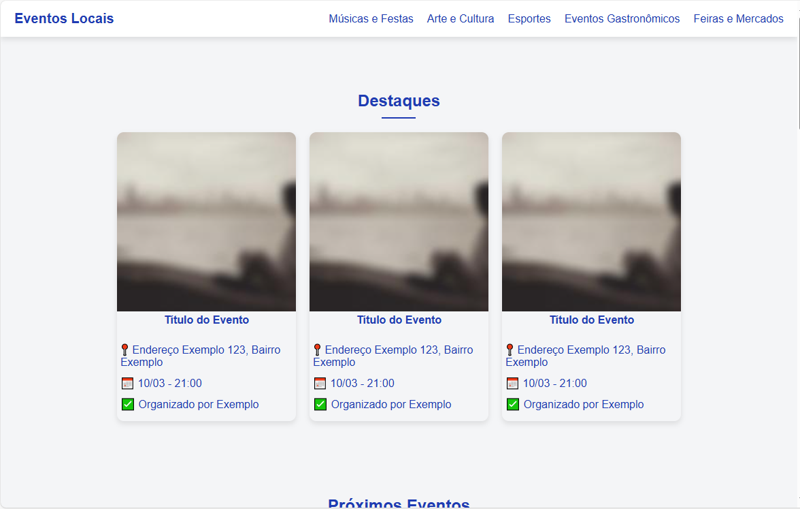
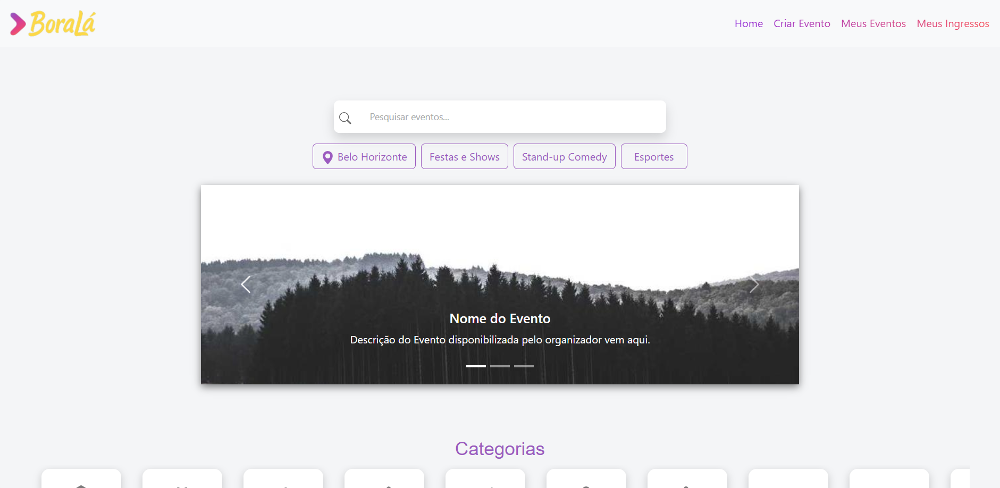
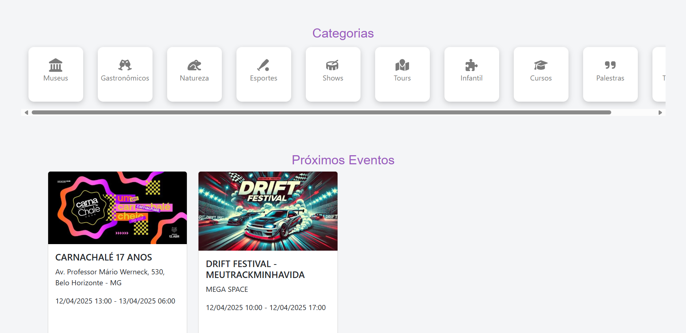
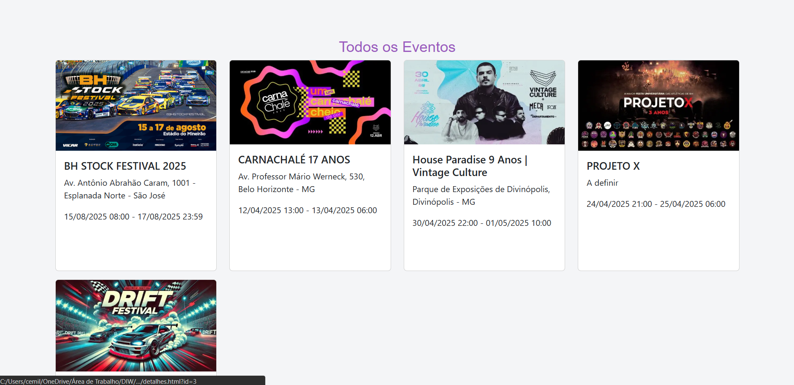
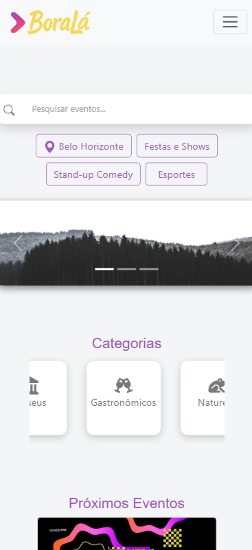
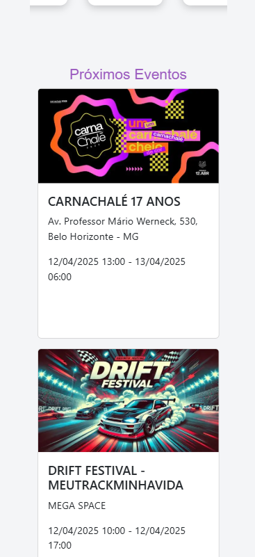
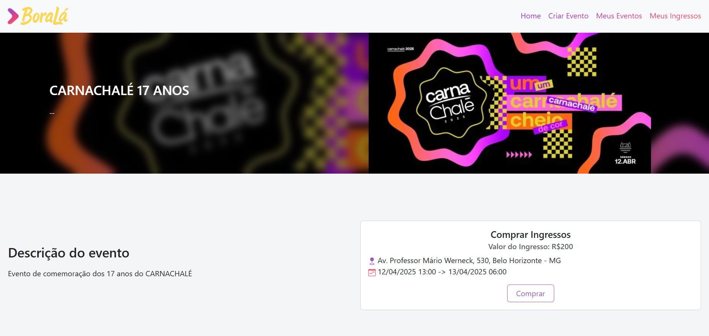

# Trabalho Prático - Semana 07

**Páginas de detalhes dinâmicas**

Nessa etapa, vamos evoluir o trabalho anterior, acrescentando a página de detalhes, conforme o  projeto escolhido. Imagine que a página principal (home-page) mostre um visão dos vários itens que existem no seu site. Ao clicar em um item, você é direcionado pra a página de detalhes. A página de detalhe vai mostrar todas as informações sobre o item do seu projeto. seja esse item uma notícia, filme, receita, lugar turístico ou evento.

Leia o enunciado completo no Canvas. 

**IMPORTANTE:** Assim como informado anteriormente, capriche na etapa pois você vai precisar dessa parte para as próximas semanas. 

**IMPORTANTE:** Você deve trabalhar e alterar apenas arquivos dentro da pasta **`public`,** mantendo os arquivos **`index.html`**, **`styles.css`** e **`app.js`** com estes nomes, conforme enunciado. Deixe todos os demais arquivos e pastas desse repositório inalterados. **PRESTE MUITA ATENÇÃO NISSO.**

## Informações Gerais

- Nome: Gabriel Evangelista Massara
- Matricula: 885810
- Proposta de projeto escolhida: Plataforma de Eventos Locais
- Breve descrição sobre seu projeto: A plataforma de eventos locais lista acontecimentos culturais, esportivos e sociais de uma cidade ou região, permitindo que os usuários encontrem eventos futuros e obtenham informações detalhadas sobre cada um.

## Print da versão responsiva com CSS puro

## Print da versão responsiva com Bootstrap

