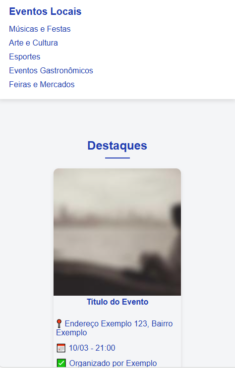
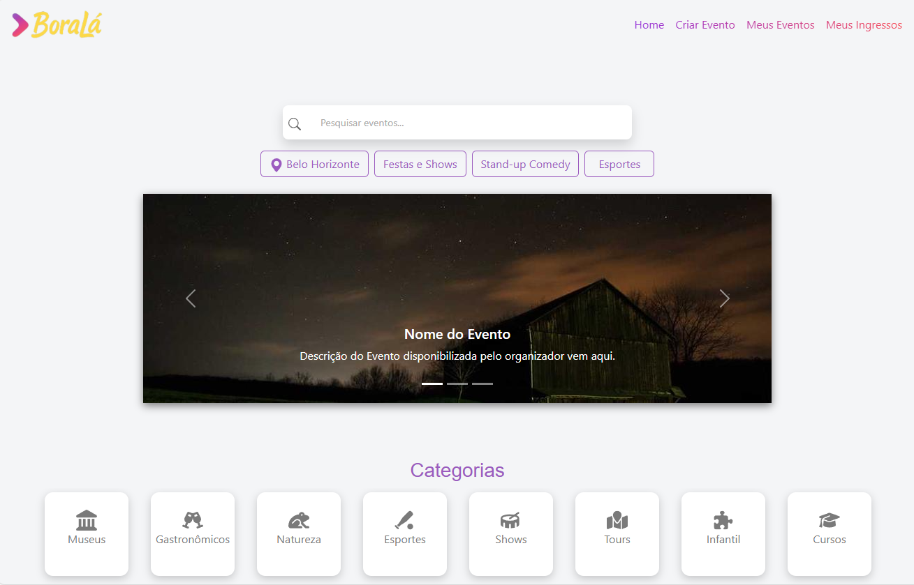
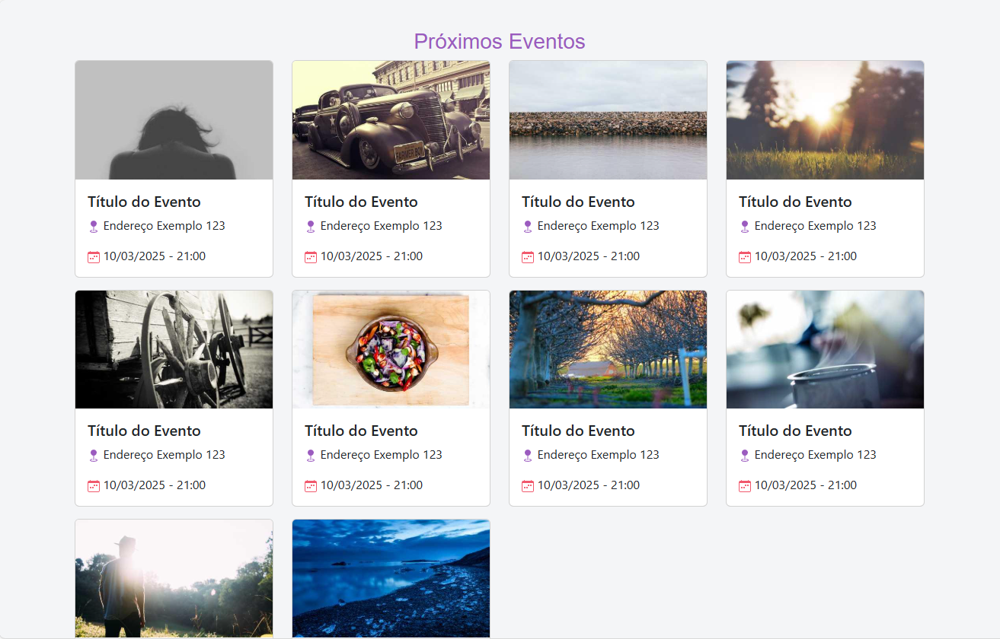
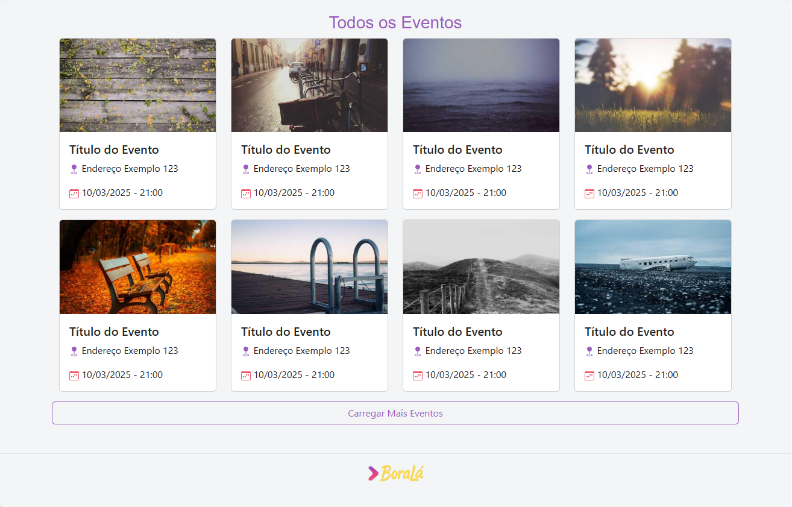
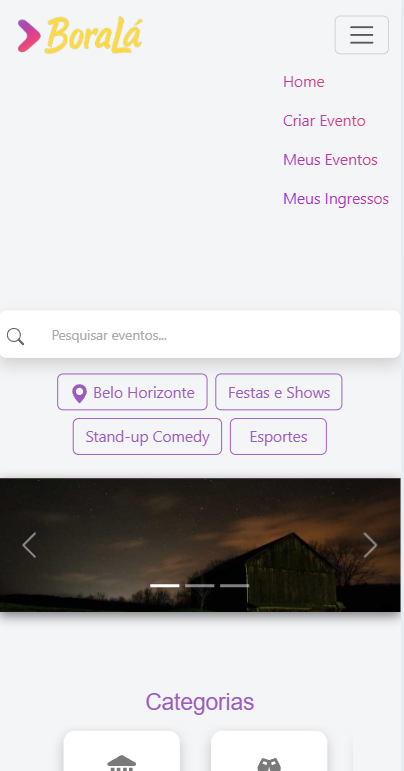
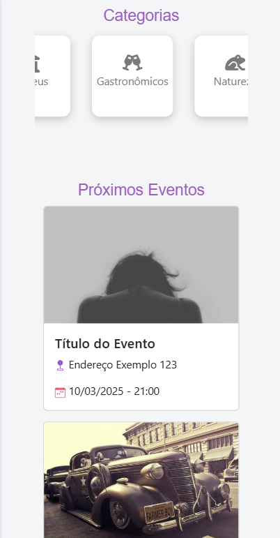

# Trabalho Prático - Semana 04 e 05

Dessa vez, vamos dar sequência ao projeto iniciado na semana passada. Se você ainda não fez o projeto da semana anterior, fique atento, se programe e procure colocar as atividades em dia. Volte lá, leia tudo e faça sua parte pois essa atividade depende da atividade anterior..

Nessa atividade,vamos evoluir o projeto para que a home-page funcione bem tanto no celular quanto no desktop, entendendo também como é o processo gradativo e colaborativo de desenvolvimento de um software, registrando cada etapa no histórico de commits do repositório do git/GitHub.

**IMPORTANTE:** Você deve trabalhar e alterar apenas arquivos dentro da pasta **`public`,** mantendo os arquivos **`index.html`** e **`styles.css`** com estes nomes. Deixe todos os demais arquivos e pastas desse repositório inalterados. **PRESTE MUITA ATENÇÃO NISSO.**

## Informações Gerais

- Nome: Gabriel Evangelista Massara
- Matricula: 885810
- Proposta de projeto escolhida: Plataforma de Eventos Locais
- Breve descrição sobre seu projeto: A plataforma de eventos locais lista acontecimentos culturais, esportivos e sociais de uma cidade ou região, permitindo que os usuários encontrem eventos futuros e obtenham informações detalhadas sobre cada um.

## Print da versão responsiva com CSS puro

## Print da versão responsiva com Bootstrap

